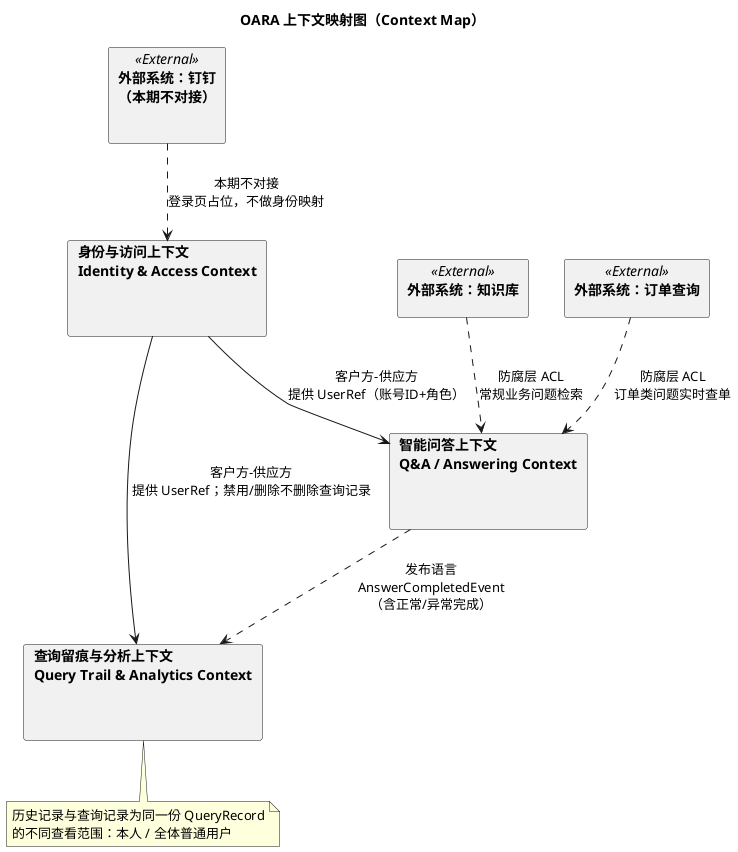
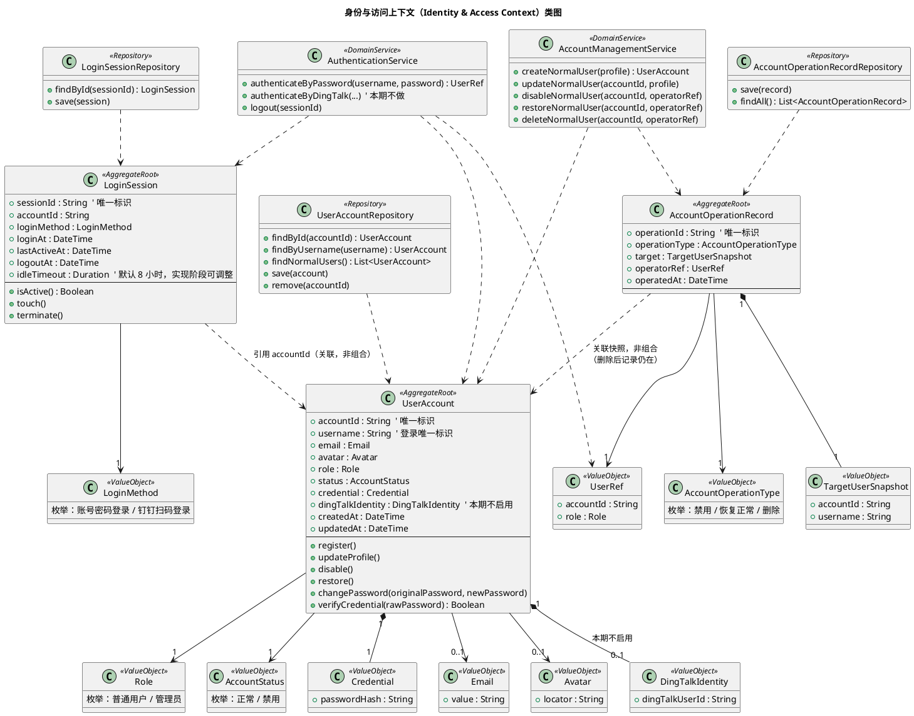
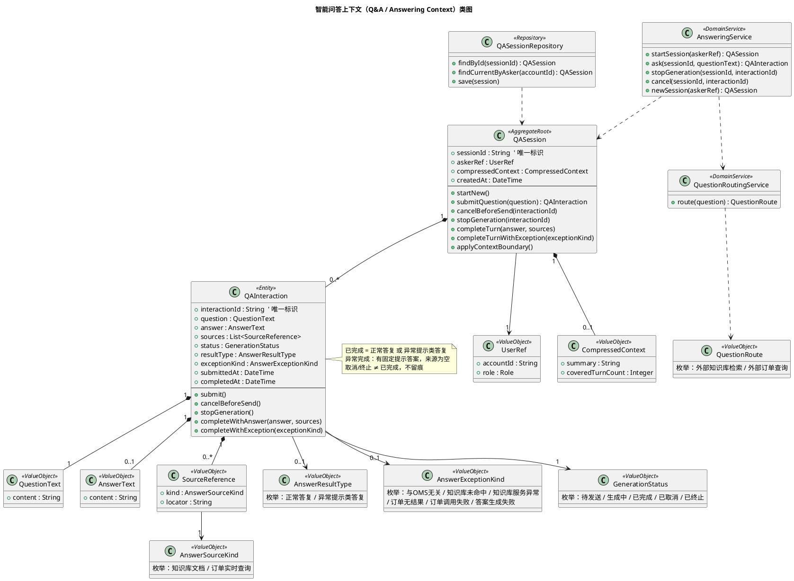
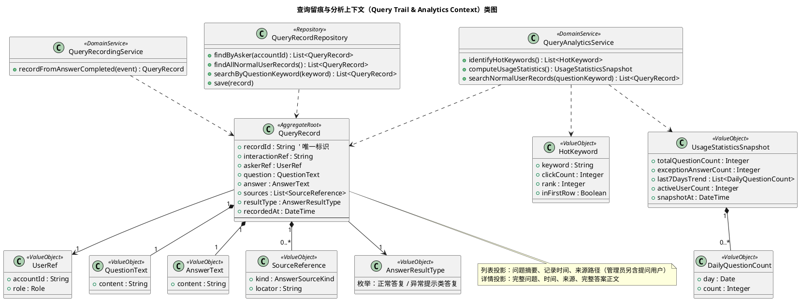
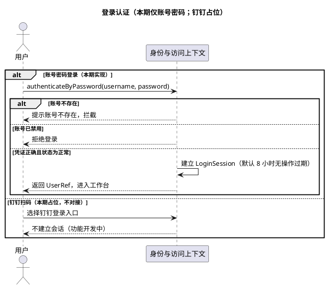
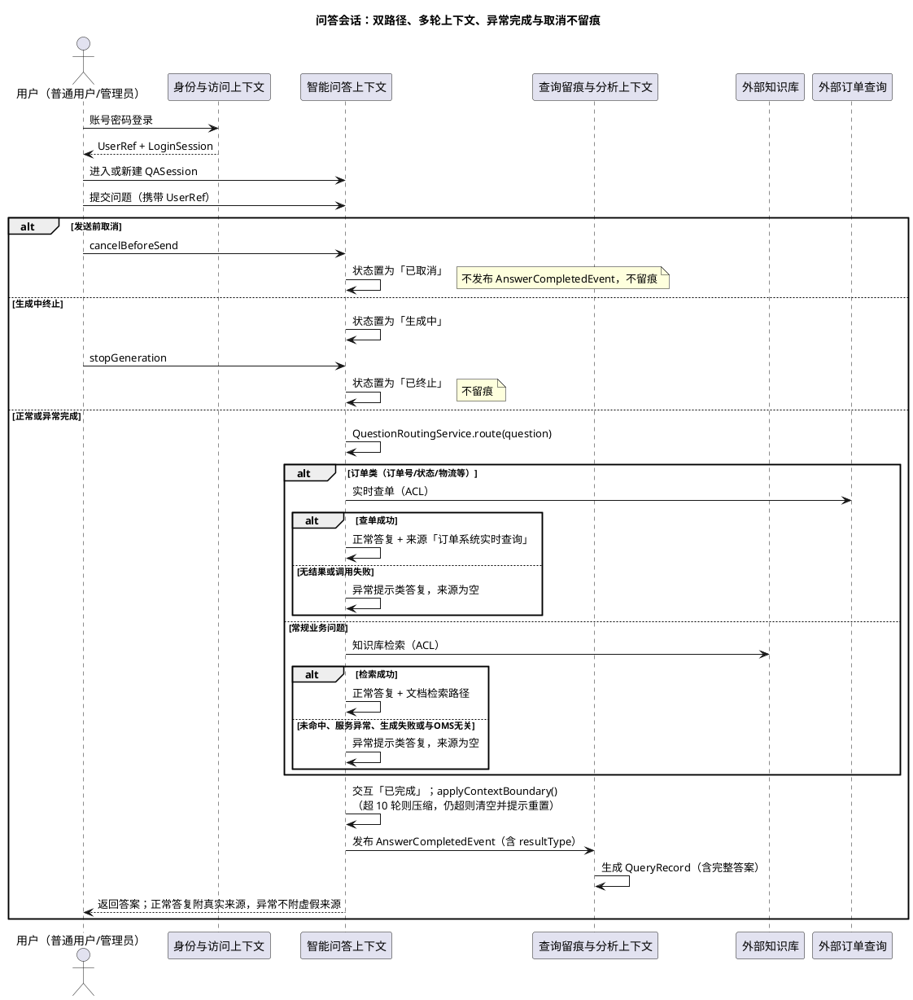
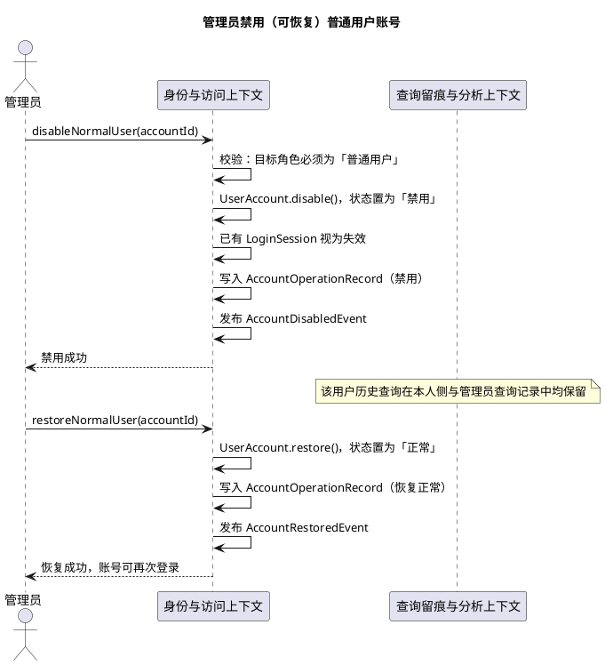
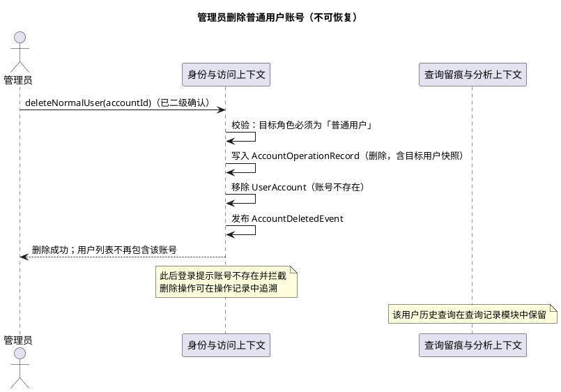
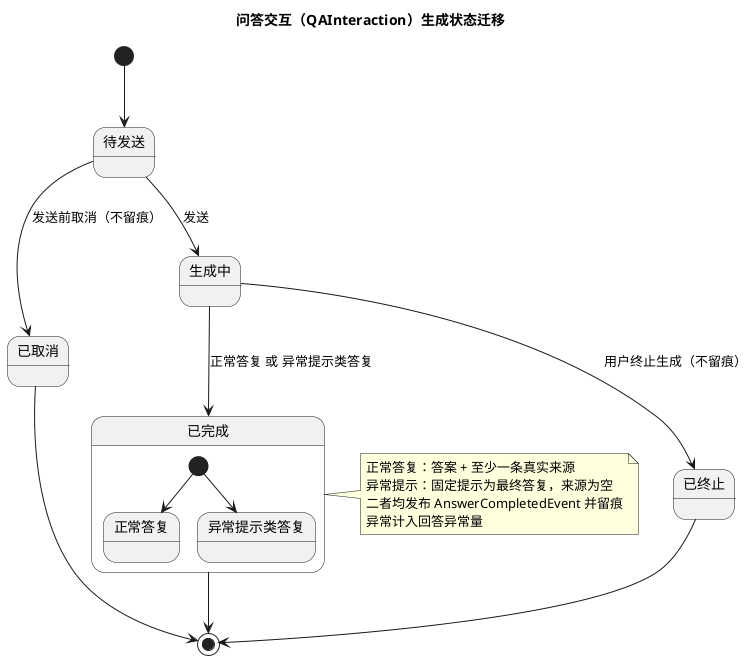
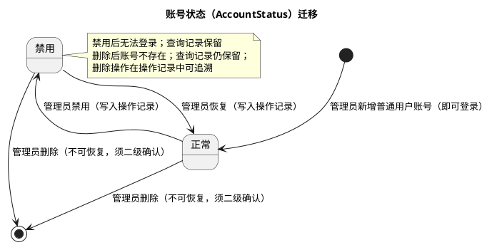

# DDD领域模型

| 项目 | 内容 |
| --- | --- |
| 文档名称 | OARA（OMS智能问答系统）领域模型（DDD） |
| 来源文档 | `docs/prd/01-OARA-PRD.md`（V1.2） |
| 建模日期 | 2026-09-08 |
| 本次更新 | 2026-09-09：按 PRD V1.2 联动更新正文（角色两级、钉钉占位、账号开通与改密、禁用/删除与操作记录、问答双路径与多轮会话、异常完成留痕、查询记录含答案、统计与高频词口径） |
| 状态 | 已与 PRD V1.2 联动更新 |

> **既有设计核查说明**：建模前已复核项目 `docs/`、`src/` 目录。`src/` 目录尚不存在，未发现代码实现；`docs/domain/` 当前未检出可对照文件（不在本次更新范围）。本文档 `docs/prd/02-领域模型.md` 为本任务唯一维护的领域模型文件。
>
> 知识库文档的建设与维护、具体的问答生成算法/检索机制均不属于 PRD 范围（PRD 第 6 节）。知识库本期外置，问答仅预留对接外部知识库的检索能力；订单类问题对接外部订单查询。本文档不引入 `KnowledgeDocument`/`KnowledgeBase` 等聚合，仅将「来源」作为答案的描述性信息（值对象）处理：常规业务问题为文档检索路径，订单类问题为查单来源说明（如「订单系统实时查询」）。
>
> **联动更新策略**：本次为同一业务 OARA 的增量更新（非全新业务）。三限界上下文划分保留；协作关系、聚合内部结构、领域事件与 PlantUML 图按 V1.2 定稿调整。原文档中仍有效的建模假设（如 `UserRef` 跨上下文对齐、`LoginSession` 独立于账号生命周期、历史记录与查询记录合并为 `QueryRecord`）予以保留并改写为正式结论；已关闭的「待确认」改为正式规则。

## 1. 业务理解总结

### 1.1 业务目标

OARA 是一套面向 OMS（订单管理系统）业务场景的智能问答系统（PRD 第 2 节）。核心业务目标：

1. 为用户提供安全、便捷的身份认证，保障系统访问可控。本期实现账号密码登录；钉钉扫码登录仅登录页占位，不对接钉钉身份体系、不做实际开发（PRD 1.3、5.1、第 6 节）。
2. 基于业务知识文档与订单实时查询提供智能问答：常规业务问题走外部知识库检索并展示文档检索路径；订单类问题调用外部订单查询接口并展示查单来源说明。答案须可追溯来源（异常提示类答复不展示虚假来源路径）。
3. 支持同一问答会话内连续追问，并回溯本人历史提问（含完整答案正文），避免重复提问、便于复查。
4. 管理员可对普通用户账号进行管理（新增/查看/修改/删除/禁用，禁用可恢复），保障账号体系可维护；禁用、删除等关键操作写入操作记录。
5. 管理员可掌握系统整体使用情况（提问总量、回答异常量、近 7 天趋势、活跃用户数）及用户高频关注问题方向（高频搜索词），为运营与知识完善提供参考。

### 1.2 核心业务流程

1. **登录**：未登录用户须先通过账号密码完成认证，成功后进入工作台。登录页可见钉钉扫码占位入口，本期不可用。会话过期或退出后须重新认证。
2. **问答（双路径 + 多轮）**：登录用户（普通用户/管理员）在同一问答会话内提问并可连续追问。常规业务问题走外部知识库；涉及具体订单号、订单状态、物流信息等需实时查单的走外部订单查询。发送前可取消、生成中可终止（均不留痕）。用户可主动「新建会话」清空当前上下文；超出上下文边界时先压缩更早对话为摘要，仍超上限则清空全部历史上下文并提示重置。
3. **问答异常**：与 OMS 无关、知识库未命中/服务异常、订单查询无结果/调用失败、答案生成失败等场景，以固定提示作为最终答复；计入回答异常量，并写入历史/查询记录；不展示虚假来源路径。
4. **历史回看**：用户查看本人已完成历史记录列表（问题摘要、记录时间、来源路径）；详情含完整问题、记录时间、来源路径、完整答案正文。只读，不可删改。
5. **用户管理**（仅管理员）：对普通用户账号新增、查看、修改、删除、禁用；禁用可恢复为正常；删除不可恢复且须二级确认。不涉及管理员账号。禁用/删除写入操作记录。
6. **统计看板**（仅管理员）：查看提问总量、回答异常量、近 7 天趋势、活跃用户数。
7. **查询记录管理**（仅管理员）：查看全体普通用户的已完成查询记录，可按问题关键词搜索（本期不做按用户、时间范围筛选）；展示高频搜索词。管理员本人提问不计入本范围及高频词。
8. **账户维护**：用户自助修改本人密码（须原密码，管理员不代改）；主动退出登录。无自助找回密码；不要求首次登录强制改密。

### 1.3 关键业务约束

- 角色仅两级：普通用户、管理员；不设更细角色（PRD 1.3、3、第 6 节）。未登录不可使用任何系统能力（PRD 5.1）。
- 用户管理仅可作用于「普通用户」角色账号，不含对管理员账号的增删改（PRD 5.5、3）。
- 正式账号由管理员新增后即可使用所设初始密码登录，不要求首次强制改密（PRD 1.3、5.1）。
- 账号状态用语为「正常 / 禁用」。禁用可恢复为正常；禁用后无法登录；该用户历史查询在本人侧与管理员查询记录中均保留。删除不可恢复，须二级确认；删除后账号不存在，登录提示账号不存在并拦截；该用户历史查询在查询记录中保留；删除操作记入操作记录（PRD 5.5.2、5.5.3）。
- 密码由用户自助修改且须校验原密码；管理员不代改；无「重置密码」作为用户侧能力；无自助找回密码（PRD 5.8.1、第 6 节）。
- 历史记录/查询记录只读，用户与管理员均不可删除或修改留痕本身（PRD 1.3、5.4、5.7）。普通用户仅能看到本人记录；管理员可看到全体普通用户记录；管理员本人提问计入其自身历史记录，但不计入全体普通用户查询记录及高频词统计（PRD 5.7）。
- 仅「已完成」的问答交互写入历史/查询记录（含正常答复与异常提示类答复）；发送前取消、生成中终止不留痕（PRD 1.3、5.3、5.3.4）。
- 问答支持同一会话内连续追问；默认保留最近 10 轮（1 轮 = 1 次提问 + 1 次作答）；超出则先压缩、再清空（PRD 5.3.2、5.3.3）。
- 高频搜索词：对普通用户查询记录问题文本分词统计；周期为全量累计；搜索/点击次数排名前三并列展示在第一排；其余按点击次数降序并展示次数；第三名并列则并列项均纳入第一排（PRD 5.7）。
- 登录态：会话过期或退出后须重新认证；默认建议 8 小时无操作过期（实现阶段可调整）（PRD 第 7 节）。

### 1.4 关键术语（统一语言 Ubiquitous Language）

| 术语 | 定义 | 别名 / PRD 原文表述 |
| --- | --- | --- |
| 用户账号（UserAccount） | 系统中可登录使用的身份主体；登录唯一标识为用户名；含邮箱、头像、角色、状态、凭证及创建/更新时间 | 「账号」「用户」（PRD 3、5.1、5.5.1） |
| 角色（Role） | 账号所属的权限类别，取值「普通用户」或「管理员」 | 「普通用户（user）」「管理员（admin）」（PRD 1.3、3） |
| 账号状态（AccountStatus） | 账号当前是否可用，取值「正常 / 禁用」；禁用后不可登录，可改回正常 | 「状态：正常 / 禁用」（PRD 5.5.1、5.5.2） |
| 登录方式（LoginMethod） | 完成身份认证所采用的途径。本期可落地仅为「账号密码登录」；「钉钉扫码登录」为占位，本期不做 | PRD 5.1、1.3 |
| 登录会话/登录态（LoginSession） | 认证成功后建立的会话状态；过期或退出后须重新认证 | PRD 5.1、5.8、第 7 节 |
| 工作台（Workbench） | 登录后统一使用入口，承载问答平台、历史记录，管理员可见管理后台入口 | PRD 1.2、5.2 |
| 管理后台（AdminConsole） | 仅管理员可见可进入的入口，承载用户管理、统计看板、查询记录管理 | PRD 5.2、5.9 |
| 操作记录（AccountOperationRecord） | 管理员对普通用户执行禁用、删除等关键操作的留痕（操作类型、目标用户、操作时间、操作人） | 「操作记录」「历史操作」（PRD 1.2、5.5.3） |
| 问答会话（QASession） | 用户在问答平台内的一次连续对话上下文，支持多轮追问，受上下文边界约束 | 「问答会话」「session」（PRD 1.2、5.3.2、5.3.3） |
| 问答交互（QAInteraction） | 会话内一次「提问—作答」过程，包含问题、答案、来源、生成状态与答复结果类型 | 「智能问答」（PRD 5.3） |
| 答复结果类型（AnswerResultType） | 已完成作答的结果分类：「正常答复」或「异常提示类答复」 | PRD 5.3.4、5.6 |
| 来源（SourceReference） | 答案所依据的信息出处：知识库文档检索路径，或订单实时查询来源说明 | 「文档检索路径 / 来源」「查单来源说明」（PRD 1.2、5.3.1） |
| 答案来源种类（AnswerSourceKind） | 来源类别：「知识库文档」或「订单实时查询」 | PRD 5.3.1、1.3 |
| 生成状态（GenerationStatus） | 问答交互所处阶段：待发送、生成中、已完成、已取消、已终止 | PRD 5.3 |
| 历史记录/查询记录（QueryRecord） | 已完成问答的留痕；本人视角为「历史记录」，管理员视角为「全体普通用户查询记录」；含完整答案正文 | PRD 5.4、5.7 |
| 高频搜索词（HotKeyword） | 对普通用户查询记录问题文本分词统计后的词项，含点击/搜索次数与排名 | 「高频搜索词」（PRD 1.2、5.7） |
| 使用情况统计（UsageStatisticsSnapshot） | 面向管理员的系统整体使用情况快照：提问总量、回答异常量、近 7 天趋势、活跃用户数 | PRD 5.6 |
| 钉钉身份（DingTalkIdentity） | 钉钉侧身份标识的占位概念；本期不对接、不启用 | PRD 5.1、第 6 节、10.1 |
| 密码凭证（Credential） | 账号密码登录所用凭证；概念级以单向哈希保存，用户自助整体替换式修改 | PRD 5.8.1、第 7 节 |

### 1.5 开放问题与建模提醒

PRD V1.2 第 10 节开放问题如下（第 9 节已是验收标准，不再引用已关闭的原开放问题编号）：

| 编号 | 事项 | 对领域模型的影响 |
| --- | --- | --- |
| 10.1 | 钉钉登录与账号关联 | 本期暂不考虑；登录页仅占位。模型中保留占位概念并标注「本期不做」，不作为可落地登录路径。 |
| 10.2 | 统计看板刷新频率与缓存策略 | 暂不考虑；实现阶段采用合理默认即可。领域模型不建模刷新/缓存策略。 |
| 10.3 | 分期交付切分 | 未定稿；不影响领域结构。 |

仍保留的建模假设（非 PRD 未决事项，见各节就近说明）：`UserRef` 作为跨上下文轻量引用；`LoginSession` 独立于 `UserAccount` 生命周期。

## 2. 限界上下文划分

### 2.1 子域划分

| 子域 | 类型 | 划分依据 |
| --- | --- | --- |
| 智能问答（Q&A / Answering） | 核心域 | PRD 背景与目标（第 2、4 节）明确「基于业务知识文档与订单实时查询的智能问答，并可追溯来源」是 OARA 区别于普通系统的核心价值，需重点建模与持续优化。 |
| 身份与访问管理（Identity & Access） | 支撑域 | 登录认证、角色权限、账号管理与操作记录（PRD 5.1、5.5、5.8、5.9）是问答能力安全可控使用的必要支撑，非产品差异化价值，但缺失则问答能力无法可控地提供。 |
| 查询留痕与运营分析（Query Trail & Analytics） | 支撑域 | 历史记录、查询记录管理、统计看板、高频搜索词（PRD 5.4、5.6、5.7）服务于「避免重复提问」「运营与知识完善参考」（PRD 4），是对核心问答能力的留痕与二次利用。 |

说明：钉钉扫码登录本期仅占位、不对接（PRD 1.3、第 6 节、10.1）。因其不属于本期可落地能力，不拆分为独立限界上下文；身份与访问上下文内部保留占位概念，外部钉钉 ACL 标注为「本期不对接」。

### 2.2 限界上下文职责

| 限界上下文 | 职责 | 核心概念 |
| --- | --- | --- |
| 身份与访问上下文（Identity & Access Context） | 账号密码认证（本期）、登录态维护与过期、退出登录、用户自助改密、普通用户账号增删改查与禁用/恢复、角色权限边界、管理员关键操作留痕；钉钉认证仅占位不启用 | UserAccount、LoginSession、AccountOperationRecord、Role、AccountStatus、LoginMethod、Credential、DingTalkIdentity（本期不启用） |
| 智能问答上下文（Q&A / Answering Context） | 维护问答会话与多轮上下文（含压缩/清空）、接收提问、按口径走知识库或订单查询、生成答案并附带来源、处理取消/终止、以固定提示完成异常答复 | QASession、QAInteraction、QuestionText、AnswerText、SourceReference、AnswerSourceKind、AnswerResultType、GenerationStatus、CompressedContext |
| 查询留痕与分析上下文（Query Trail & Analytics Context） | 记录已完成问答的留痕（本人历史 / 全体普通用户查询记录，含完整答案）、按问题关键词检索、统计高频搜索词、汇总四项使用情况指标 | QueryRecord、HotKeyword、UsageStatisticsSnapshot |

**建模结论（原「待确认」关闭）**：PRD V1.2 中「历史记录」与「查询记录」信息项对齐（问题、时间、来源、完整答案；管理员列表另含提问用户），且明确管理员本人提问出现在自己历史中、不计入全体普通用户查询记录及高频词。本文档按「同一份留痕数据、不同查看范围」合并建模为统一聚合 `QueryRecord`。

### 2.3 上下文协作关系

- **身份与访问上下文 → 智能问答上下文**：客户方-供应方（Customer-Supplier）。智能问答上下文依赖身份与访问上下文提供的「当前登录用户引用」（`UserRef`：账号标识 + 角色）确定提问归属，自身不维护账号信息。
- **身份与访问上下文 → 查询留痕与分析上下文**：客户方-供应方。查询留痕与分析上下文依赖 `UserRef` 判定记录归属与可见范围（本人 / 全体普通用户）；账号禁用或删除不删除既有查询记录。
- **智能问答上下文 → 查询留痕与分析上下文**：发布语言（Published Language）/ 领域事件集成。问答交互进入「已完成」（含正常答复与异常提示类答复）后发布 `AnswerCompletedEvent`（携带答复结果类型），查询留痕与分析上下文订阅该事件生成查询记录。发送前取消、生成中终止不发布完成事件，故不留痕（PRD 1.3、5.3）。
- **外部系统：知识库 → 智能问答上下文**：防腐层（Anti-Corruption Layer）。常规业务问题经 ACL 调用外部知识库检索，得到答案与文档检索路径；检索不可用或未命中按异常提示完成。
- **外部系统：订单查询 → 智能问答上下文**：防腐层。订单类问题经 ACL 调用外部订单查询接口，得到答案与查单来源说明；无有效结果或调用失败按异常提示完成。
- **外部系统：钉钉 → 身份与访问上下文**：本期不对接。不建立可落地的钉钉身份映射路径（PRD 10.1）。

为避免智能问答上下文、查询留痕与分析上下文直接依赖身份与访问上下文的完整 `UserAccount` 聚合，抽象出轻量值对象 `UserRef`（账号标识 + 角色）作为跨上下文传递的「当前用户」引用；`UserRef`、`QuestionText`、`SourceReference` 在各上下文类图中重复出现，代表跨上下文概念对齐（同一业务语义），并非同一份可共享的技术实现类，各上下文内部可有各自的本地表达。此为**建模假设**，需在后续详细设计时明确是否采用共享内核或各自独立定义。

上下文映射图见第 6 节 6.1。

## 3. 聚合设计

### 3.1 身份与访问上下文

**聚合根：UserAccount（用户账号）**
- 唯一标识：`accountId`（聚合内技术标识）；业务登录唯一标识为 `username`（PRD 5.5.1）。
- 职责：承载账号的身份、联系与展示信息、角色、状态、登录凭证，是登录认证与用户管理的核心业务对象。
- 聚合边界：内含 `Credential`（密码凭证，组合）；`Role`、`AccountStatus`、`Email`、`Avatar` 为自身属性值对象。`DingTalkIdentity` 仅作本期不启用的占位组合（0..1），不参与可落地认证。
- 不变量：
  1. 账号角色只能是「普通用户」或「管理员」二者之一；不设更细角色（PRD 1.3、3、第 6 节）。
  2. `username` 为登录唯一标识，同一系统内不可重复。
  3. 账号状态为「禁用」时不可用于建立新的登录会话，已有会话在访问校验时因账号非「正常」而失效（PRD 5.5.2；已有会话失效为对「禁用后无法登录」的领域归纳）。
  4. 用户管理（新增/修改/删除/禁用/恢复）仅可作用于角色为「普通用户」的账号，不可作用于「管理员」账号（PRD 5.5、3）。
  5. 管理员新增后账号即可登录，不要求首次强制改密（PRD 1.3、5.1）。
  6. 密码仅允许持有者自助修改：须校验原密码后整体替换凭证；管理员不代改；不提供重置密码、不提供自助找回（PRD 5.8.1、第 6 节）。密码存储采用单向哈希等概念级保护，传输与存储细节属非功能需求，不在本模型展开（PRD 第 7 节）。
- 关键属性：账号标识、用户名、邮箱、头像、角色、账号状态、密码凭证、创建时间、更新时间；钉钉身份（可选，本期不启用）。
- 核心业务行为：`register()` 由管理员新增普通用户、`updateProfile()` 修改邮箱/头像等信息（更新 `updatedAt`）、`disable()` 禁用、`restore()` 恢复为正常、`changePassword(originalPassword, newPassword)` 自助改密、`verifyCredential(rawPassword)` 校验凭证。删除由领域服务协调（见下），删除后聚合不再存在。

**聚合根：LoginSession（登录会话）**（**建模假设**：PRD 未将「登录会话」写成独立持久化名词，依据「登录成功后进入工作台」「会话过期或退出后须重新认证」（PRD 5.1、5.8、第 7 节）将登录态抽象为独立轻量聚合，与 `UserAccount` 通过账号标识关联而非组合，避免登录态产生/结束影响账号本身生命周期。）
- 唯一标识：`sessionId`
- 职责：承载「当前登录用户是谁、以何种本期启用的方式登录、是否仍有效」的语义。
- 聚合边界：仅持有对 `UserAccount` 的引用（`accountId`），不直接包含 `UserAccount` 实体。
- 不变量：
  1. 登录会话必须关联一个处于「正常」状态的账号方可建立（PRD 5.1、5.5.2）。账号不存在时认证失败并提示账号不存在（PRD 5.5.2）。
  2. 本期可建立会话的登录方式仅为「账号密码登录」；钉钉扫码不建立真实会话（PRD 5.1）。
  3. 会话结束（登出）或过期后不可再用于访问系统能力，须重新认证（PRD 5.8.2、第 7 节）。
  4. 默认无操作过期时长为 8 小时；实现阶段可调整（PRD 第 7 节）。
  5. 用户自助改密成功后不强制结束当前会话（PRD 5.8.1）。
- 关键属性：会话标识、关联账号标识、登录方式、登录时间、最近活动时间、登出时间、空闲过期时长（默认 8 小时）。
- 核心业务行为：`isActive()` 判断是否有效（未登出、未空闲过期）、`touch()` 刷新最近活动时间、`terminate()` 结束会话。

**聚合根：AccountOperationRecord（操作记录）**
- 唯一标识：`operationId`
- 职责：记录管理员对普通用户执行的禁用、删除等关键操作，供事后追溯。被删除用户从用户列表移除后，其删除操作仍可在此追溯（PRD 5.5.3）。
- 聚合边界：独立于 `UserAccount` 生命周期（关联而非组合），以便账号删除后记录仍在。内含操作类型、目标用户快照、操作人引用、操作时间。
- 不变量：
  1. 记录一旦生成不可修改、不可删除（与账号关键操作可追溯一致）。
  2. 操作类型至少包含「禁用」「删除」；将状态改回「正常」同属关键状态变更，一并记入（对 PRD「禁用、删除等」的领域归纳）。
  3. 目标用户以快照保存（至少含用户名及当时账号标识），不因账号删除而丢失可追溯性。
  4. 操作人必须为管理员角色。
- 关键属性：操作标识、操作类型、目标用户快照、操作人引用（`UserRef`）、操作时间。
- 核心业务行为：仅支持创建与查看。

**值对象**（均不可变，任何变更均通过整体替换实现）：

| 值对象 | 说明 |
| --- | --- |
| Role | 枚举：「普通用户」/「管理员」，不可变 |
| AccountStatus | 枚举：「正常」/「禁用」，不可变（「正常」与旧稿「启用」等价，正式用语以「正常」为准） |
| LoginMethod | 枚举：「账号密码登录」/「钉钉扫码登录」，不可变；后者本期不启用 |
| Credential | 密码凭证，概念级含 `passwordHash`，不可变，整体替换式修改 |
| Email | 用户邮箱，不可变 |
| Avatar | 展示用头像标识，不可变 |
| DingTalkIdentity | 钉钉侧身份标识占位，不可变；**本期不做**，不用于认证与账号关联（PRD 10.1） |
| UserRef | 跨上下文引用的「当前用户」轻量值对象：账号标识 + 角色，不可变 |
| AccountOperationType | 枚举：禁用 / 恢复正常 / 删除，不可变 |
| TargetUserSnapshot | 被操作对象快照：账号标识 + 用户名，不可变 |

**仓储**：`UserAccountRepository`（按账号标识/用户名查找；按角色查询普通用户列表；保存账号；删除账号）、`LoginSessionRepository`（按会话标识查找；保存/结束会话）、`AccountOperationRecordRepository`（保存操作记录；按时间查询历史操作列表）。不提供按钉钉身份查找的可落地能力。

---

### 3.2 智能问答上下文

**聚合根：QASession（问答会话）**
- 唯一标识：`sessionId`
- 职责：维护同一用户一次连续对话的上下文：轮次、压缩摘要、上下文边界；接收本会话内的提问与作答。
- 聚合边界：内含本会话的 `QAInteraction`（组合）、可选的 `CompressedContext`；不包含提问者账号完整信息，仅持有 `UserRef`。用于后续作答的有效上下文 = 最近 10 轮已完成交互 + 压缩摘要。
- 不变量：
  1. 会话必须归属一个已登录用户（`UserRef` 非空），不支持匿名提问（PRD 5.1）。
  2. 默认保留最近 10 轮已完成问答（1 轮 = 1 次用户提问 + 1 次系统作答）。实现阶段可按 token 上限等价换算，用户侧感知仍为「最近若干轮」（PRD 5.3.3）。
  3. 超出边界时按顺序：先对超出保留轮次的更早对话生成摘要作为压缩上下文；若压缩后仍超出上限，则清空全部历史上下文，并产生可感知提示：「对话上下文已重置，请重新描述您的问题。」（PRD 5.3.3）
  4. 用户主动「新建会话」清空当前上下文，从零开始（PRD 5.3.2）。
  5. 被压缩或清空前已完成作答的交互，仍按留痕规则发布完成事件；压缩/清空本身不删除已生成的查询记录（PRD 5.3.3）。
- 关键属性：会话标识、提问者引用、压缩上下文（可选）、创建时间、最近活动时间。
- 核心业务行为：`startNew()` 新建会话、`submitQuestion(question)` 在当前会话提问、`cancelBeforeSend(interactionId)`、`stopGeneration(interactionId)`、`completeTurn(...)` / `completeTurnWithException(...)`、`applyContextBoundary()` 压缩或重置。

**实体：QAInteraction（问答交互）**（归属 `QASession`，非独立聚合根）
- 唯一标识：`interactionId`
- 职责：承载会话内一次「提问—作答」过程，包括问题、答案、来源、生成状态、答复结果类型。
- 不变量：
  1. 仅「待发送」可执行「取消」，仅「生成中」可执行「终止」（PRD 5.3）。
  2. 「已完成」时必须具备最终答复文本。**正常答复**须同时具备至少一条真实来源（知识库文档路径或订单查单来源说明）；**异常提示类答复**以固定提示为最终答复，来源集合为空，禁止填入虚假来源路径（PRD 5.3.1、5.3.4）。
  3. 取消、终止不是「已完成」，不发布完成事件，故不留痕（PRD 1.3、5.3）。
  4. 异常场景固定提示（PRD 5.3.4）：与 OMS 业务无关 →「系统提示：该问题暂时无法回答」；知识库未检索到 →「未找到相关业务文档，请尝试换个问法或联系管理员补充知识库。」；知识库检索服务异常 →「文档检索暂时不可用，请稍后重试。」；订单查询无有效结果 →「未查询到相关订单信息，请核对订单号后重试。」；订单查询调用失败 →「订单查询暂时不可用，请稍后重试。」；答案生成失败 →「答案生成失败，请稍后重试。」
- 关键属性：交互标识、问题文本、答案文本（可选）、来源集合、生成状态、答复结果类型（已完成时）、异常种类（异常完成时）、提交时间、完成时间。
- 核心业务行为：`submit()`、`cancelBeforeSend()`、`stopGeneration()`、`completeWithAnswer(answer, sources)`、`completeWithException(exceptionKind)`。

**值对象**（均不可变）：

| 值对象 | 说明 |
| --- | --- |
| UserRef | 提问者引用（账号标识 + 角色），来自身份与访问上下文，不可变 |
| QuestionText | 问题文本内容，不可变 |
| AnswerText | 答案文本内容（含异常固定提示），不可变 |
| AnswerSourceKind | 枚举：「知识库文档」/「订单实时查询」，不可变 |
| SourceReference | 来源：种类 + 定位说明（文档检索路径或如「订单系统实时查询」），不可变 |
| AnswerResultType | 枚举：「正常答复」/「异常提示类答复」，不可变 |
| AnswerExceptionKind | 枚举：与 OMS 无关 / 知识库未命中 / 知识库服务异常 / 订单无结果 / 订单调用失败 / 答案生成失败，不可变 |
| QuestionRoute | 枚举：「外部知识库检索」/「外部订单查询」，不可变；判定口径见领域服务 |
| GenerationStatus | 枚举：「待发送」/「生成中」/「已完成」/「已取消」/「已终止」，不可变 |
| CompressedContext | 更早对话的摘要文本及所覆盖轮次，不可变，作为后续理解用的压缩上下文 |

**仓储**：`QASessionRepository`（保存会话；按标识查找；查找用户当前会话）。

说明：答案生成所依赖的知识文档检索/订单查询/生成机制的内部算法不属于 PRD 范围（PRD 第 6 节）。本文档只确认双路径能力边界与异常完成语义，不建模外部知识库或订单系统内部结构。

---

### 3.3 查询留痕与分析上下文

**聚合根：QueryRecord（查询记录）**
- 唯一标识：`recordId`
- 职责：承载已完成问答交互的留痕，供本人历史记录查看、管理员查询记录管理查看与统计分析使用。
- 聚合边界：内含完整问题、完整答案正文、来源集合、提问者引用、答复结果类型、记录时间；关联问答交互标识。列表视角可只暴露问题摘要、记录时间、来源路径（管理员另含提问用户）；详情视角暴露完整问题、时间、来源、完整答案——这是同一聚合的不同读取投影，不是两套概念（PRD 5.4、5.7）。
- 不变量：
  1. 每条查询记录一旦生成，用户与管理员均不可删除或修改留痕本身（PRD 1.3、5.4、5.7）。
  2. 仅由「已完成」问答生成（含正常答复与异常提示类答复）；取消/终止不产生记录（PRD 1.3、5.3.4）。
  3. 普通用户仅可查看归属自己的查询记录（「历史记录」视角）；管理员可查看归属所有普通用户的查询记录（「查询记录管理」视角）；管理员本人的查询记录不计入「全体普通用户查询记录」及高频词统计（PRD 5.7）。
  4. 记录归属账号被禁用或删除后，既有查询记录仍保留：禁用时本人侧与管理员查询记录均保留；删除后账号不存在，但查询记录模块中仍保留该用户历史查询（PRD 5.5.2）。
  5. 异常提示类记录必须保存固定提示作为答案正文，来源集合为空（不展示虚假来源）。
- 关键属性：记录标识、关联交互引用、提问者引用、问题文本、答案文本、来源集合、答复结果类型、记录时间。
- 核心业务行为：仅支持创建与查看，不提供修改/删除行为。

**值对象**（均不可变）：

| 值对象 | 说明 |
| --- | --- |
| HotKeyword | 高频搜索词：词汇文本 + 点击/搜索次数 + 排名 + 是否纳入第一排（前三并列），不可变。统计周期为全量累计；对普通用户查询记录问题文本分词；排名前三并列置顶第一排，第三名并列则并列项均纳入第一排；其余按点击次数降序（PRD 5.7） |
| DailyQuestionCount | 某日提问量（已完成次数），不可变，用于近 7 天趋势 |
| UsageStatisticsSnapshot | 使用情况统计快照，不可变。指标：提问总量（累计已完成次数，含正常答复与异常提示类答复）、回答异常量（累计异常提示类答复次数）、近 7 天趋势（日粒度 `DailyQuestionCount` 列表）、活跃用户数（近 7 天内至少 1 次已完成问答的去重用户数）（PRD 5.6） |
| UserRef / QuestionText / AnswerText / SourceReference / AnswerResultType | 与其他上下文概念对齐（见 2.3），不可变 |

**仓储**：`QueryRecordRepository`（按提问者查找——本人历史记录视角；查找全体普通用户记录——管理员视角；按问题关键词搜索全体普通用户记录——本期仅关键词，不做按用户/时间范围筛选；保存记录；不提供删除/更新方法）。

## 4. 领域服务

| 所属上下文 | 领域服务 | 职责 |
| --- | --- | --- |
| 身份与访问上下文 | AuthenticationService | 校验账号密码并建立登录会话，返回 `UserRef`；处理登出。钉钉认证方法仅占位，本期不启用。方法轮廓：`authenticateByPassword(username, password): UserRef`、`authenticateByDingTalk(...)`（**本期不做**，不可建立真实会话）、`logout(sessionId)` |
| 身份与访问上下文 | AccountManagementService | 面向管理员的普通用户账号管理，校验「仅可操作普通用户」；禁用/恢复/删除时写入操作记录。方法轮廓：`createNormalUser(profile): UserAccount`、`updateNormalUser(accountId, profile)`、`disableNormalUser(accountId, operatorRef)`、`restoreNormalUser(accountId, operatorRef)`、`deleteNormalUser(accountId, operatorRef)`（须二级确认意图后方可执行） |
| 智能问答上下文 | QuestionRoutingService | 按业务口径判定提问路径：涉及具体订单号、订单状态、物流信息等需实时查单的走外部订单查询；其余规范/流程/政策走外部知识库。方法轮廓：`route(question): QuestionRoute` |
| 智能问答上下文 | AnsweringService | 协调会话内提问、取消、终止、双路径作答与异常完成，并在完成后发布 `AnswerCompletedEvent`；维护上下文边界。方法轮廓：`startSession(askerRef): QASession`、`ask(sessionId, questionText): QAInteraction`、`stopGeneration(sessionId, interactionId)`、`cancel(sessionId, interactionId)`、`newSession(askerRef): QASession`。外部知识库/订单查询经防腐层调用，内部检索与生成算法不在建模范围 |
| 查询留痕与分析上下文 | QueryRecordingService | 订阅 `AnswerCompletedEvent`（含异常完成），生成对应查询记录。方法轮廓：`recordFromAnswerCompleted(event: AnswerCompletedEvent): QueryRecord` |
| 查询留痕与分析上下文 | QueryAnalyticsService | 对查询记录统计分析。方法轮廓：`identifyHotKeywords(): List<HotKeyword>`（仅普通用户记录、全量分词、前三并列第一排）、`computeUsageStatistics(): UsageStatisticsSnapshot`（四项已定指标）、`searchNormalUserRecords(questionKeyword): List<QueryRecord>`（本期仅问题关键词） |

## 5. 领域事件

| 所属上下文 | 事件 | 触发条件 | 后续影响 |
| --- | --- | --- | --- |
| 身份与访问上下文 | AccountRegisteredEvent | 管理员新增普通用户账号成功 | 账号可立即用于登录（不强制改密） |
| 身份与访问上下文 | AccountUpdatedEvent | 管理员修改普通用户信息成功（邮箱、头像等） | 账号信息变更生效，`updatedAt` 更新 |
| 身份与访问上下文 | AccountDisabledEvent | 管理员禁用普通用户账号 | 该账号不可登录；已有会话失效；写入操作记录；查询记录保留 |
| 身份与访问上下文 | AccountRestoredEvent | 管理员将禁用账号改回正常 | 账号可再次登录；写入操作记录 |
| 身份与访问上下文 | AccountDeletedEvent | 管理员删除普通用户账号（已二级确认） | 账号不存在，登录提示账号不存在并拦截；查询记录保留；写入操作记录 |
| 身份与访问上下文 | PasswordChangedEvent | 用户自助修改密码成功 | 后续登录须使用新密码；当前会话不强制结束 |
| 身份与访问上下文 | UserLoggedInEvent | 用户通过账号密码认证成功 | 建立登录会话，进入工作台 |
| 身份与访问上下文 | UserLoggedOutEvent | 用户主动退出登录 | 登录会话结束，须重新认证 |
| 智能问答上下文 | SessionStartedEvent | 用户进入问答或主动新建会话 | 当前上下文从空开始 |
| 智能问答上下文 | QuestionSubmittedEvent | 用户发送问题 | 交互进入「生成中」 |
| 智能问答上下文 | QuestionCancelledEvent | 用户在发送前取消 | 交互置为「已取消」；**不留痕** |
| 智能问答上下文 | AnswerGenerationStoppedEvent | 用户在生成过程中终止 | 交互置为「已终止」；**不留痕** |
| 智能问答上下文 | AnswerCompletedEvent | 交互已完成（正常答复或异常提示类答复均发布；携带 `AnswerResultType` 及可选 `AnswerExceptionKind`） | 向查询留痕与分析上下文发布，生成查询记录；异常完成计入回答异常量 |
| 智能问答上下文 | SessionContextCompressedEvent | 超出保留轮次，更早对话被压缩为摘要 | 后续作答使用压缩上下文 + 最近 10 轮；被压缩前已完成交互已留痕 |
| 智能问答上下文 | SessionContextResetEvent | 压缩后仍超上限，清空全部历史上下文 | 提示「对话上下文已重置，请重新描述您的问题。」；已完成交互已留痕 |
| 查询留痕与分析上下文 | QueryRecordCreatedEvent | 订阅 `AnswerCompletedEvent` 后成功生成查询记录 | 可供本人历史 / 管理员查询记录查看；纳入高频词与四项统计的原始数据 |

## 6. PlantUML UML类图

### 6.1 上下文映射图（Context Map）

### 6.2 身份与访问上下文类图

### 6.3 智能问答上下文类图

### 6.4 查询留痕与分析上下文类图

### 6.5 补充：关键业务流程时序图——账号密码登录（钉钉占位）

### 6.6 补充：关键业务流程时序图——会话问答、压缩/重置、异常完成、取消不留痕

### 6.7 补充：关键业务流程时序图——管理员禁用与恢复普通用户账号

### 6.8 补充：关键业务流程时序图——管理员删除普通用户账号

### 6.9 补充：状态图——问答交互（QAInteraction）生成状态迁移

### 6.10 补充：状态图——账号状态（AccountStatus）迁移

