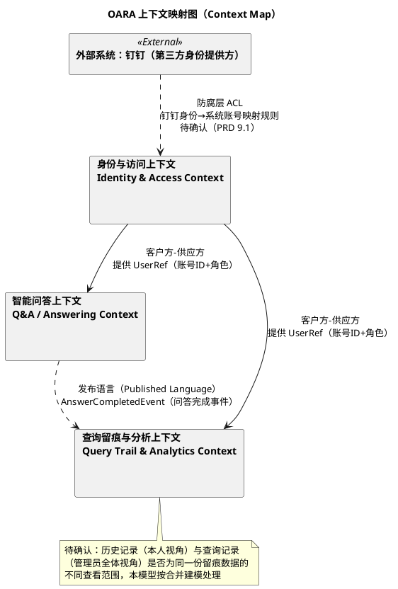
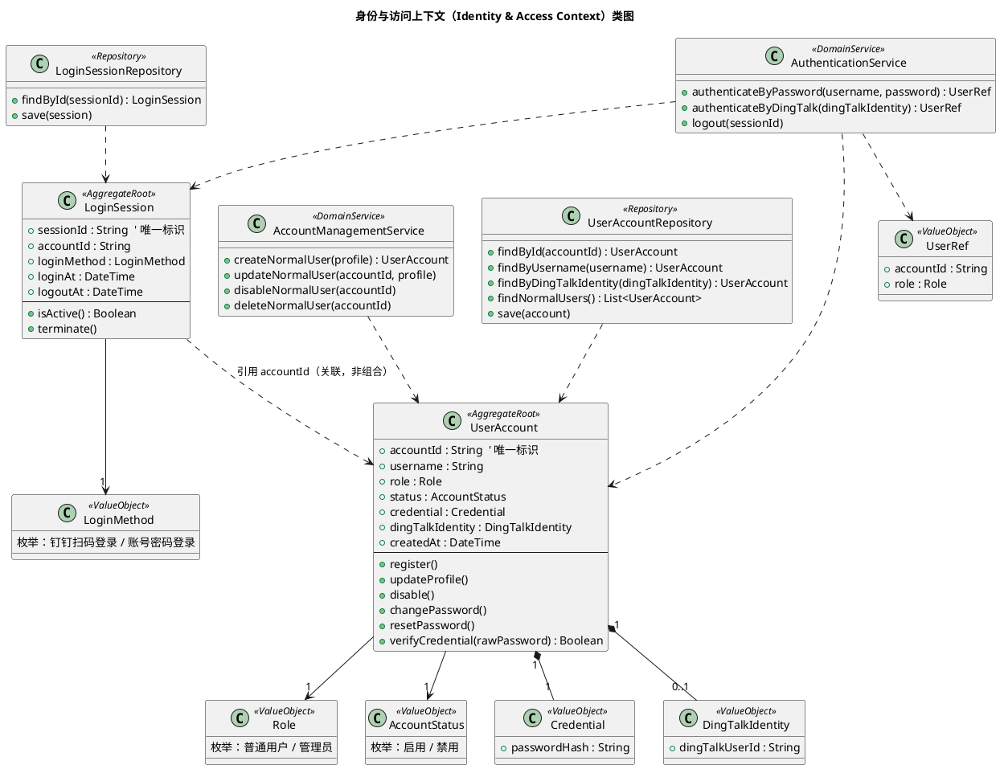
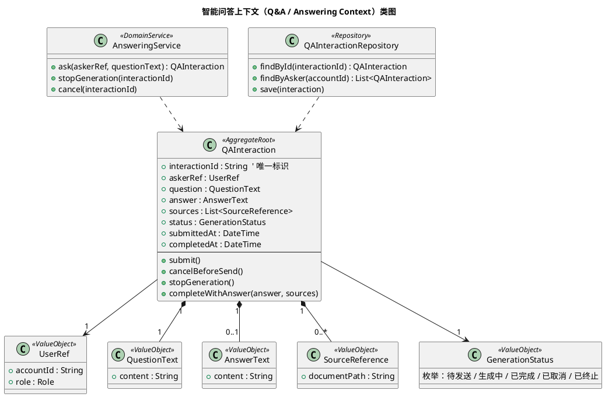
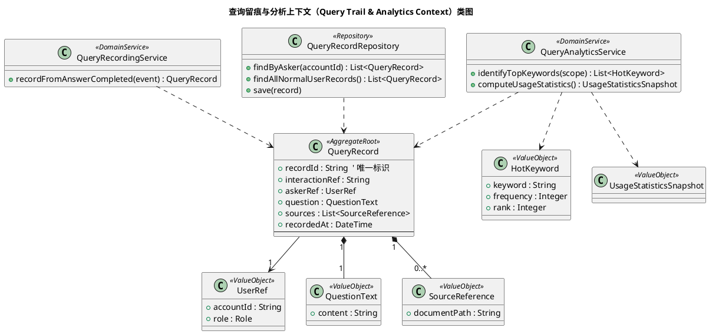
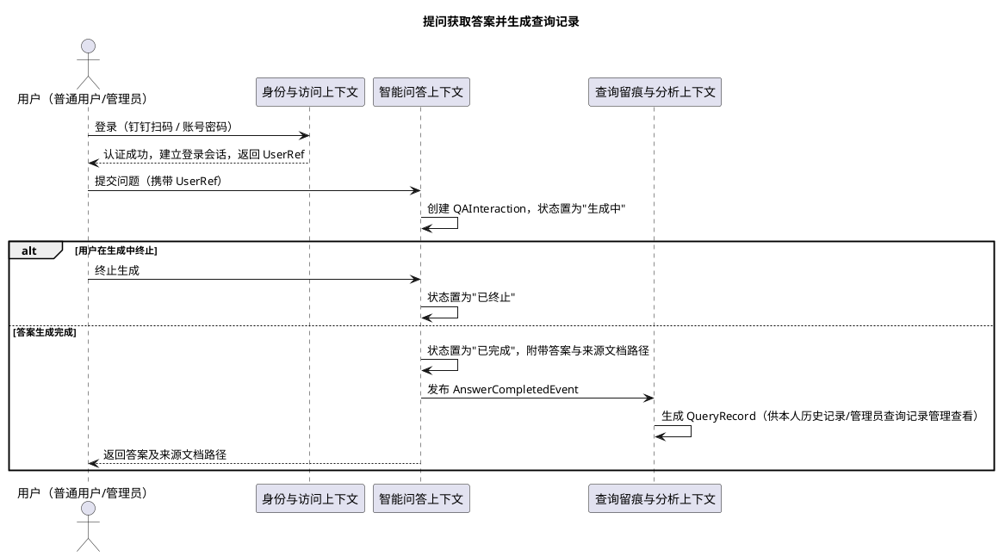
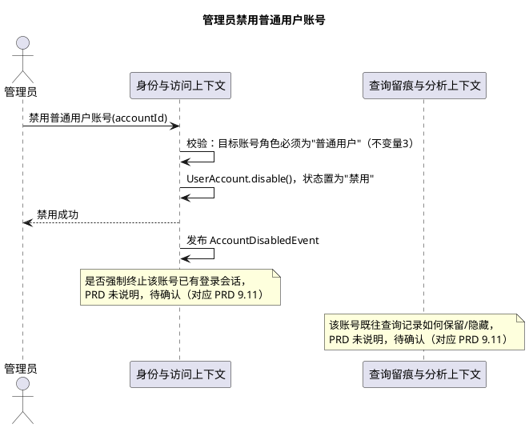
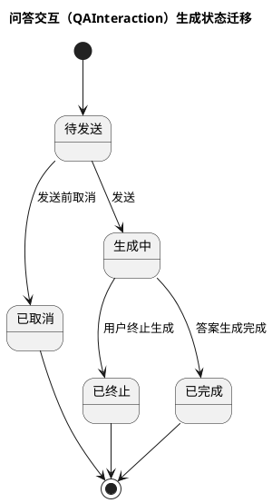
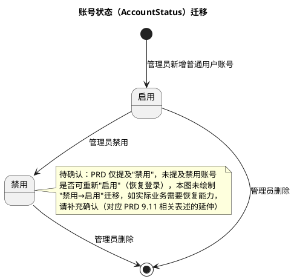

# DDD领域模型

| 项目 | 内容 |
| --- | --- |
| 文档名称 | OARA（OMS智能问答系统）领域模型（DDD） |
| 来源文档 | `docs/prd/OARA-PRD.md`（V1.1） |
| 建模日期 | 2026-09-08 |
| 本次更新 | 图表语法规范化：将原文档中的 Mermaid（上下文映射图、类图、时序图、状态图）全部转换为 PlantUML，并按固定结构（业务理解总结→限界上下文划分→聚合设计→领域服务→领域事件→PlantUML UML类图）重新组织正文；限界上下文与聚合设计未发生业务变化，原文档已核实有效的"待确认"标注与建模假设予以保留 |
| 状态 | 草稿，待与 PRD 责任人核实文中标注的"待确认"事项 |

> **既有设计核查说明**：建模前已复核项目 `docs/`、`src/` 目录。`src/` 目录尚不存在，未发现代码实现；`docs/domain/OARA-领域模型.md` 是基于同一份 PRD（V1.1）独立产出的另一份领域模型文档，本文档与其在子域划分、限界上下文边界、聚合设计（UserAccount、LoginSession、QAInteraction、QueryRecord）上保持一致，未发现冲突，可视为对同一份领域理解的正式产出。若后续两份文档需要合并维护，建议以其中一份为唯一来源、另一份改为引用，避免重复维护，此为**流程性建议**，非领域建模结论本身。
>
> 知识库文档的建设与维护、具体的问答生成算法/检索机制均不属于 PRD 范围（PRD 第 6 节、第 9.4 条），本文档不对其进行领域建模，仅将"来源文档路径"作为答案的描述性信息（值对象）处理，不引入 `KnowledgeDocument`/`KnowledgeBase` 等聚合。

## 1. 业务理解总结

### 1.1 业务目标

OARA 是一套面向 OMS（订单管理系统）业务场景的智能问答系统（PRD 第 2 节）。核心业务目标：

1. 为用户提供安全、便捷的身份认证，保障系统访问可控（钉钉扫码登录 / 账号密码登录二选一）。
2. 基于业务知识文档提供智能问答，答案须同时展示来源文档检索路径，解决传统人工检索效率低、答案不可追溯的问题。
3. 用户可回溯本人历史提问，避免重复提问。
4. 管理员可对普通用户账号进行管理（新增/查看/修改/删除/禁用），保障账号体系可维护。
5. 管理员可掌握系统整体使用情况及用户高频关注问题方向（统计看板 + 高频搜索词前三置顶），为运营与知识完善提供参考。

### 1.2 核心业务流程

1. **登录**：未登录用户须先通过钉钉扫码或账号密码完成认证，成功后进入工作台。
2. **问答**：登录用户（普通用户/管理员）在问答平台提出问题并发送；发送前可取消；发送后生成过程中可终止；生成完成后得到答案及来源文档路径。
3. **历史回看**：用户查看本人历史查询列表，每条可查看当时的问题、记录时间、返回的来源文件路径（不含答案正文，见 9.7）。
4. **用户管理**（仅管理员）：对普通用户账号进行新增、查看、修改、删除、禁用；不涉及管理员账号。
5. **统计看板**（仅管理员）：查看系统整体使用情况统计（具体指标见 9.9，待确认）。
6. **查询记录管理**（仅管理员）：查看全体普通用户的查询记录，并置顶搜索频率前三的高频词。
7. **账户维护**：用户可修改/重置本人密码、主动退出登录。

### 1.3 关键业务约束

- 角色仅两级：普通用户、管理员（PRD 3），未登录不可使用任何系统能力（PRD 5.1）。
- 用户管理仅可作用于"普通用户"角色账号，不含对管理员账号的增删改（PRD 5.5、验收标准 8）。
- 历史记录/查询记录仅支持查看，不可删除、不可修改（PRD 5.4）；普通用户仅能看到本人记录，管理员可看到全体普通用户的记录，且管理员本人的提问计入其自身历史记录、但不计入"全体普通用户查询记录"统计（PRD 验收标准 6）。
- 一次问答为"一次提问、一次作答"，暂不支持连续追问（PRD 9.6，待确认）。
- 高频搜索词取排名前三置顶展示（PRD 5.7）。
- 被禁用的普通用户账号不可再登录（PRD 5.5、验收标准 9）。

### 1.4 关键术语（统一语言 Ubiquitous Language）

| 术语 | 定义 | 别名 / PRD 原文表述 |
| --- | --- | --- |
| 用户账号（UserAccount） | 系统中可登录使用的身份主体，具有唯一账号标识、角色、状态、登录凭证 | "账号"、"用户"（PRD 3、5.1、5.5） |
| 角色（Role） | 账号所属的权限类别，取值"普通用户"或"管理员" | "普通用户（user）""管理员（admin）"（PRD 3） |
| 账号状态（AccountStatus） | 账号当前是否可用，取值"启用/禁用"；禁用后不可登录 | "禁用等状态管理"（PRD 5.5） |
| 登录方式（LoginMethod） | 完成身份认证所采用的途径，取值"钉钉扫码登录"或"账号密码登录" | PRD 5.1 |
| 登录会话/登录态（LoginSession） | 认证成功后建立的会话状态，标识"当前已登录用户"，退出登录后结束 | PRD 5.1、5.8 |
| 工作台（Workbench） | 登录后统一使用入口，承载问答平台、历史记录，管理员可见管理后台入口 | PRD 1.1、5.2 |
| 管理后台（AdminConsole） | 仅管理员可见可进入的入口，承载用户管理、统计看板、查询记录管理 | PRD 5.2、5.9 |
| 问答交互（QAInteraction） | 一次"提问—作答"过程，包含问题、答案、来源、生成状态 | "智能问答"（PRD 5.3） |
| 来源文档路径（SourceReference） | 答案所依据的业务知识文档检索路径，用于追溯出处 | PRD 1.1、5.3 |
| 生成状态（GenerationStatus） | 问答交互所处阶段：待发送、生成中、已完成、已取消、已终止 | PRD 5.3 |
| 历史记录/查询记录（QueryRecord） | 问答完成后生成的留痕记录，本人视角为"历史记录"、管理员视角为"全体普通用户查询记录"（见 2.2 待确认说明） | PRD 5.4、5.7 |
| 高频搜索词（HotKeyword） | 对查询记录问题文本统计后得出的高频词，取排名前三置顶展示 | PRD 5.7 |
| 使用情况统计（UsageStatistics） | 面向管理员的系统整体使用情况汇总信息，具体指标未定（PRD 9.9，待确认） | PRD 5.6 |
| 钉钉身份（DingTalkIdentity） | 钉钉扫码登录使用的第三方身份标识，与系统账号的关联规则未明确（PRD 9.1，待确认） | PRD 5.1 |
| 密码凭证（Credential） | 账号密码登录所用凭证，支持修改与重置 | PRD 5.8 |

### 1.5 与本次建模关系不大但需提醒的待确认事项

以下 PRD 第 9 节事项不直接影响领域模型结构，仅作提醒：登录页是否长期展示测试账号密码（PRD 9.2）；是否分期交付（PRD 9.14）。其余待确认事项均已在第 2、3、4、5 节对应位置就近标注。

## 2. 限界上下文划分

### 2.1 子域划分

| 子域 | 类型 | 划分依据 |
| --- | --- | --- |
| 智能问答（Q&A / Answering） | 核心域 | PRD 背景与目标（第 2、4 节）明确"基于业务知识文档的智能问答，并可追溯来源"是 OARA 区别于普通系统的核心价值，需重点建模与持续优化。 |
| 身份与访问管理（Identity & Access） | 支撑域 | 登录认证、角色权限、账号管理（PRD 5.1、5.5、5.9）是问答能力安全可控使用的必要支撑，非产品差异化价值，但缺失则问答能力无法可控地提供。 |
| 查询留痕与运营分析（Query Trail & Analytics） | 支撑域 | 历史记录、查询记录管理、统计看板、高频搜索词（PRD 5.4、5.6、5.7）服务于"避免重复提问""运营与知识完善参考"（PRD 4），是对核心问答能力的留痕与二次利用。 |

说明：钉钉扫码登录本质上对接第三方通用身份能力（PRD 6 明确"钉钉登录以外的其他第三方账号体系"不涉及），属于通用能力范畴；由于 PRD 未单独描述其独立业务规则与边界，未拆分为独立限界上下文，而是作为身份与访问上下文内部的一种登录方式与外部集成点处理。

### 2.2 限界上下文职责

| 限界上下文 | 职责 | 核心概念 |
| --- | --- | --- |
| 身份与访问上下文（Identity & Access Context） | 登录认证（钉钉扫码/账号密码）、登录态维护、退出登录、密码修改与重置、普通用户账号增删改查与禁用（用户管理）、角色权限边界落地 | UserAccount、LoginSession、Role、AccountStatus、LoginMethod、Credential、DingTalkIdentity |
| 智能问答上下文（Q&A / Answering Context） | 接收提问、生成答案并附带来源文档路径、发送前取消、生成中终止 | QAInteraction、QuestionText、AnswerText、SourceReference、GenerationStatus |
| 查询留痕与分析上下文（Query Trail & Analytics Context） | 记录每次问答的留痕信息（本人历史记录 / 全体普通用户查询记录）、统计高频搜索词并置顶前三、汇总使用情况统计 | QueryRecord、HotKeyword、UsageStatisticsSnapshot |

**待确认**：PRD 未明确"历史记录"（用户视角）与"查询记录"（管理员视角）在业务上是否为同一份留痕数据的两种查看权限，还是两套独立业务概念。本文档按"同一份留痕数据、不同查看范围"合并建模为统一聚合 `QueryRecord`（理由：二者记录信息项完全一致——问题、时间、来源文件路径；验收标准 6 明确"管理员本人提问出现在自己历史记录中，但不计入全体普通用户查询记录统计"，说明二者是对同一类记录按角色/归属做的不同范围查询），此为**建模假设**，请核实。

### 2.3 上下文协作关系

- **身份与访问上下文 → 智能问答上下文**：客户方-供应方（Customer-Supplier）关系。智能问答上下文依赖身份与访问上下文提供的"当前登录用户引用"（`UserRef`：账号标识 + 角色）确定提问归属，自身不维护账号信息。
- **身份与访问上下文 → 查询留痕与分析上下文**：客户方-供应方关系。查询留痕与分析上下文依赖 `UserRef` 判定记录归属与可见范围（本人 / 全体普通用户）。
- **智能问答上下文 → 查询留痕与分析上下文**：发布语言（Published Language）/ 领域事件集成。问答完成后发布 `AnswerCompletedEvent`，查询留痕与分析上下文订阅该事件生成查询记录，两上下文不直接共享聚合或数据存储（**建模假设**：仅"已完成"状态的问答交互驱动生成查询记录；发送前取消、生成中终止的交互是否留痕，PRD 未说明，按不留痕处理，若需留痕请确认调整）。
- **外部系统钉钉 → 身份与访问上下文**：防腐层（Anti-Corruption Layer）关系。钉钉扫码登录涉及外部身份体系，身份与访问上下文通过防腐层将钉钉身份标识转换为系统内的用户引用；具体组织绑定、身份映射规则 PRD 未说明，**待确认**（对应 PRD 9.1）。

为避免智能问答上下文、查询留痕与分析上下文直接依赖身份与访问上下文的完整 `UserAccount` 聚合，抽象出轻量值对象 `UserRef`（账号标识 + 角色）作为跨上下文传递的"当前用户"引用；`UserRef`、`QuestionText`、`SourceReference` 在各上下文类图中重复出现，代表跨上下文概念对齐（同一业务语义），并非同一份可共享的技术实现类，各上下文内部可有各自的本地表达，此为**建模假设**，需在后续详细设计时明确是否采用共享内核或各自独立定义。

上下文映射图见第 6 节 6.1。

## 3. 聚合设计

### 3.1 身份与访问上下文

**聚合根：UserAccount（用户账号）**
- 唯一标识：`accountId`
- 职责：承载账号的身份、角色、状态、登录凭证信息，是登录认证与用户管理的核心业务对象。
- 聚合边界：内含 `Credential`（密码凭证，组合）、`DingTalkIdentity`（钉钉身份标识，组合，可选）；`Role`、`AccountStatus` 为其自身属性值对象。
- 不变量：
  1. 账号角色只能是"普通用户"或"管理员"二者之一（PRD 3；是否存在更细角色分层未定，PRD 9.13，**待确认**）。
  2. 账号状态为"禁用"时不可用于建立新的登录会话（PRD 5.5、验收标准 9）。
  3. 用户管理（新增/修改/删除/禁用）仅可作用于角色为"普通用户"的账号，不可作用于"管理员"账号（PRD 5.5、验收标准 8）。
  4. 密码凭证一经设置需支持修改或重置（PRD 5.8），具体强度规则、找回方式未定（PRD 9.3、9.8，**待确认**）。
- 关键属性：账号标识、用户名、角色、账号状态、密码凭证、钉钉身份（可选）、创建时间。
- 核心业务行为：`register()` 注册账号、`updateProfile()` 修改信息、`disable()` 禁用、`changePassword()` / `resetPassword()` 修改或重置密码、`verifyCredential(rawPassword)` 校验凭证。

**聚合根：LoginSession（登录会话）**（**建模假设**：PRD 未明确要求"登录会话"作为持久化领域概念，依据"登录成功后进入工作台""退出后需重新认证"（PRD 5.1、5.8、验收标准 12）的业务规则，将登录态抽象为独立轻量聚合，与 `UserAccount` 通过账号标识关联而非组合，避免登录态产生/结束影响账号本身生命周期。）
- 唯一标识：`sessionId`
- 职责：承载"当前登录用户是谁、以何种方式登录、何时登出"的语义。
- 聚合边界：仅持有对 `UserAccount` 的引用（`accountId`），不直接包含 `UserAccount` 实体。
- 不变量：
  1. 登录会话必须关联一个处于"启用"状态的账号方可建立（对应验收标准 1、9）。
  2. 会话结束（登出）后不可再用于访问系统能力，需重新认证（PRD 5.8、验收标准 12）。
- 关键属性：会话标识、关联账号标识、登录方式、登录时间、登出时间。
- 核心业务行为：`isActive()` 判断是否有效、`terminate()` 结束会话。

**值对象**（均不可变，任何变更均通过整体替换实现）：

| 值对象 | 说明 |
| --- | --- |
| Role | 枚举："普通用户" / "管理员"，不可变 |
| AccountStatus | 枚举："启用" / "禁用"，不可变 |
| LoginMethod | 枚举："钉钉扫码登录" / "账号密码登录"，不可变 |
| Credential | 密码凭证，不可变，整体替换式修改，不支持局部编辑 |
| DingTalkIdentity | 钉钉侧身份标识，不可变，用于登录关联；与系统账号绑定规则待确认（PRD 9.1） |
| UserRef | 跨上下文引用的"当前用户"轻量值对象：账号标识 + 角色，不可变，不携带账号其他隐私信息 |

**仓储**：`UserAccountRepository`（按账号标识/用户名/钉钉身份查找账号；按角色查询普通用户列表；保存账号）、`LoginSessionRepository`（按会话标识查找会话；保存/结束会话）。

---

### 3.2 智能问答上下文

**聚合根：QAInteraction（问答交互）**
- 唯一标识：`interactionId`
- 职责：承载一次"提问—作答"的完整过程，包括问题、答案、来源、生成状态。
- 聚合边界：内含问题文本、答案文本（可选，视生成状态而定）、来源文档路径集合、生成状态；不包含提问者账号完整信息，仅持有 `UserRef` 引用。
- 不变量：
  1. 每次问答交互必须归属一个已登录用户（`UserRef` 非空），系统不支持匿名提问（PRD 5.1）。
  2. 生成状态为"已完成"之前，答案内容为空；进入"已完成"状态时必须同时具备答案内容与至少一条来源文档路径（PRD 5.3）。
  3. 仅"待发送"状态下可执行"取消"，仅"生成中"状态下可执行"终止"（PRD 5.3）。
  4. 一次问答交互对应"一次提问、一次作答"，本期不建模同一交互内的多轮追问上下文关联（PRD 9.6，**待确认**）。
  5. 无相关文档、检索不到内容、生成失败等异常情形下交互应如何呈现结果尚未明确，**待确认**（PRD 9.5），本期不为此单独建模异常状态分支。
- 关键属性：交互标识、提问者引用（`UserRef`）、问题文本、答案文本（可选）、来源文档路径集合、生成状态、提交时间、完成时间。
- 核心业务行为：`submit()` 发送问题、`cancelBeforeSend()` 发送前取消、`stopGeneration()` 生成中终止、`completeWithAnswer(answer, sources)` 完成并附带答案与来源。

**值对象**（均不可变）：

| 值对象 | 说明 |
| --- | --- |
| UserRef | 提问者引用（账号标识 + 角色），来自身份与访问上下文，不可变 |
| QuestionText | 问题文本内容，不可变 |
| AnswerText | 答案文本内容，不可变 |
| SourceReference | 来源文档检索路径，不可变 |
| GenerationStatus | 枚举："待发送" / "生成中" / "已完成" / "已取消" / "已终止"，不可变 |

**仓储**：`QAInteractionRepository`（保存问答交互；按提问者查找交互列表；按标识查找单条交互）。

说明：答案生成所依赖的知识文档检索/生成机制本身不属于 PRD 范围（PRD 第 6 节、9.4），本文档不对其内部机制建模，仅确认"依据业务知识文档生成答案并携带来源"的能力边界。

---

### 3.3 查询留痕与分析上下文

**聚合根：QueryRecord（查询记录）**
- 唯一标识：`recordId`
- 职责：承载问答交互完成后的留痕信息，供本人历史记录查看、管理员查询记录管理查看与统计分析使用。
- 聚合边界：内含问题文本、来源文档路径集合、提问者引用、记录时间；不包含答案正文（PRD 5.4 明确本期查看项仅为问题、时间、来源路径，是否需要答案正文见 PRD 9.7，**待确认**）。
- 不变量：
  1. 每条查询记录一旦生成，不可被用户删除或修改（PRD 5.4）；管理员是否可删除查询记录 PRD 未提及，**待确认**，默认按不可删除处理。
  2. 普通用户仅可查看归属自己的查询记录（"历史记录"视角）；管理员可查看归属所有普通用户的查询记录（"查询记录管理"视角），且管理员本人的查询记录不计入"全体普通用户查询记录"统计范围（PRD 验收标准 6）。
  3. 记录归属账号被禁用或删除后，其既有查询记录如何保留或隐藏 PRD 未说明，**待确认**（PRD 9.11）。
- 关键属性：记录标识、关联问答交互引用、提问者引用（`UserRef`）、问题文本、来源文档路径集合、记录时间。
- 核心业务行为：仅支持创建与查看，不提供修改/删除行为，以体现"不可篡改"的业务规则。

**值对象**（均不可变）：

| 值对象 | 说明 |
| --- | --- |
| HotKeyword | 高频搜索词：词汇文本 + 出现频次 + 排名，不可变，用于置顶展示排名前三（统计周期、分词粒度、并列排名处理规则均未定，PRD 9.10，**待确认**） |
| UsageStatisticsSnapshot | 使用情况统计快照，不可变，承载系统整体使用情况汇总指标；具体指标项未定，PRD 9.9，**待确认**，本文档仅作占位轮廓，不预设具体字段 |
| UserRef / QuestionText / SourceReference | 与其他上下文概念对齐（见 2.3 说明），不可变 |

**仓储**：`QueryRecordRepository`（按提问者查找查询记录——本人历史记录视角；查找全体普通用户的查询记录——管理员查询记录管理视角；保存记录；不提供删除/更新方法）。

## 4. 领域服务

| 所属上下文 | 领域服务 | 职责 |
| --- | --- | --- |
| 身份与访问上下文 | AuthenticationService | 校验账号密码或钉钉身份，认证成功后建立登录会话并返回 `UserRef`；处理登出。方法轮廓：`authenticateByPassword(username, password): UserRef`、`authenticateByDingTalk(dingTalkIdentity): UserRef`、`logout(sessionId)` |
| 身份与访问上下文 | AccountManagementService | 面向管理员的普通用户账号管理，内部校验"仅可操作普通用户角色账号"这一跨聚合规则。方法轮廓：`createNormalUser(profile): UserAccount`、`updateNormalUser(accountId, profile)`、`disableNormalUser(accountId)`、`deleteNormalUser(accountId)` |
| 智能问答上下文 | AnsweringService | 接收提问并协调答案生成过程的发起/终止/取消。方法轮廓：`ask(askerRef, questionText): QAInteraction`、`stopGeneration(interactionId)`、`cancel(interactionId)`。答案生成所依赖的检索/生成机制不在建模范围内（PRD 9.4） |
| 查询留痕与分析上下文 | QueryRecordingService | 订阅智能问答上下文发布的 `AnswerCompletedEvent`，据此生成对应查询记录（体现"发布语言"式松耦合集成，而非主动查询问答交互数据）。方法轮廓：`recordFromAnswerCompleted(event: AnswerCompletedEvent): QueryRecord` |
| 查询留痕与分析上下文 | QueryAnalyticsService | 对查询记录进行统计分析。方法轮廓：`identifyTopKeywords(scope): List<HotKeyword>`（识别高频搜索词并排名前三，统计口径待确认 PRD 9.10）、`computeUsageStatistics(): UsageStatisticsSnapshot`（汇总使用情况统计，具体指标待确认 PRD 9.9） |

## 5. 领域事件

| 所属上下文 | 事件 | 触发条件 | 后续影响 |
| --- | --- | --- | --- |
| 身份与访问上下文 | AccountRegisteredEvent | 管理员新增普通用户账号成功 | 账号可用于登录（**建模推断**：PRD 未显性提及事件，依据"新增账号"状态变化归纳） |
| 身份与访问上下文 | AccountUpdatedEvent | 管理员修改普通用户账号信息成功 | 账号信息变更生效 |
| 身份与访问上下文 | AccountDisabledEvent | 管理员禁用普通用户账号 | 该账号后续登录尝试应被拒绝；是否需强制终止该账号已有登录会话，PRD 未说明，**待确认** |
| 身份与访问上下文 | AccountDeletedEvent | 管理员删除普通用户账号 | 账号不可再用于登录；该账号既往查询记录如何处理，PRD 未说明，**待确认**（对应 PRD 9.11） |
| 身份与访问上下文 | PasswordChangedEvent / PasswordResetEvent | 用户修改或重置本人密码 | 后续登录须使用新密码 |
| 身份与访问上下文 | UserLoggedInEvent | 用户通过任一登录方式认证成功 | 建立登录会话，进入工作台；可作为使用情况统计（如活跃用户）数据来源之一（**建模推断**） |
| 身份与访问上下文 | UserLoggedOutEvent | 用户主动退出登录 | 登录会话结束，需重新认证方可继续使用 |
| 智能问答上下文 | QuestionSubmittedEvent | 用户发送问题 | 交互进入"生成中"状态 |
| 智能问答上下文 | QuestionCancelledEvent | 用户在发送前取消 | 交互置为"已取消"；是否需持久化留痕，PRD 未说明，**待确认** |
| 智能问答上下文 | AnswerGenerationStoppedEvent | 用户在生成过程中终止 | 交互置为"已终止"；已生成的部分答案是否保留，PRD 未说明，**待确认** |
| 智能问答上下文 | AnswerCompletedEvent | 答案生成完成 | 交互置为"已完成"；向查询留痕与分析上下文发布（跨上下文集成事件），用于生成查询记录 |
| 查询留痕与分析上下文 | QueryRecordCreatedEvent | 订阅 `AnswerCompletedEvent` 后成功生成查询记录 | 记录可供本人历史记录 / 管理员查询记录管理查看；纳入高频搜索词与使用情况统计的原始数据（**建模推断**：PRD 未显性提及事件本身，依据统计分析的数据来源归纳） |

## 6. PlantUML UML类图

### 6.1 上下文映射图（Context Map）

### 6.2 身份与访问上下文类图

### 6.3 智能问答上下文类图

### 6.4 查询留痕与分析上下文类图

### 6.5 补充：关键业务流程时序图——提问获取答案并生成查询记录

### 6.6 补充：关键业务流程时序图——管理员禁用普通用户账号

### 6.7 补充：状态图——问答交互（QAInteraction）生成状态迁移

### 6.8 补充：状态图——账号状态（AccountStatus）迁移

